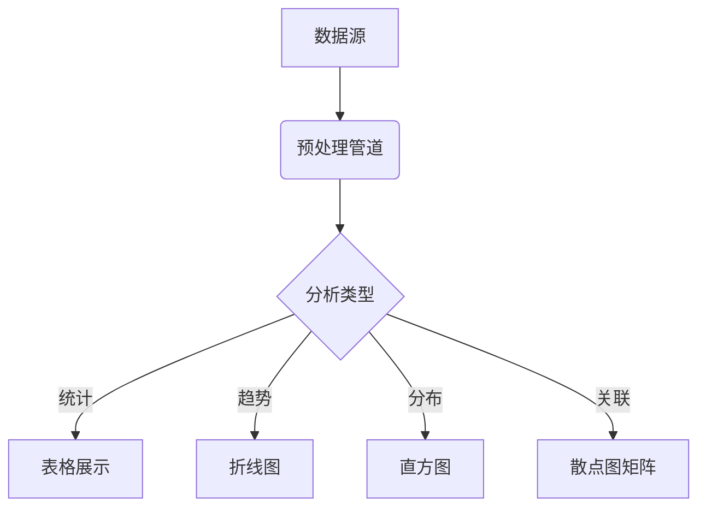

# 数据分析可视化系统产品需求文档

## 一、业务背景
面向中小企业的运营数据分析平台，提供：
- 多数据源接入（CSV/API/数据库）
- 智能数据清洗管道
- 交互式可视化看板
- 团队协作与报告生成

## 二、核心功能模块
### 数据接入层
- 文件上传解析（CSV/Excel）
- 数据库直连（MySQL/PostgreSQL）
- REST API 数据抓取

### 分析引擎
- 自动类型识别（数值/分类/时间序列）
- 缺失值处理策略
- 异常值检测算法

### 可视化看板

## 三、技术架构
1. 前端：Next.js + TailwindCSS + DaisyUI
2. 后端：FastAPI + SQLite
3. 数据可视化：Chart.js + Plotly
4. 状态管理：Zustand
5. 测试框架：Jest + Cypress

## 四、部署方案
1. 使用Docker容器化部署
2. 配置CI/CD流水线
3. 实现自动扩缩容
4. 配置监控告警系统