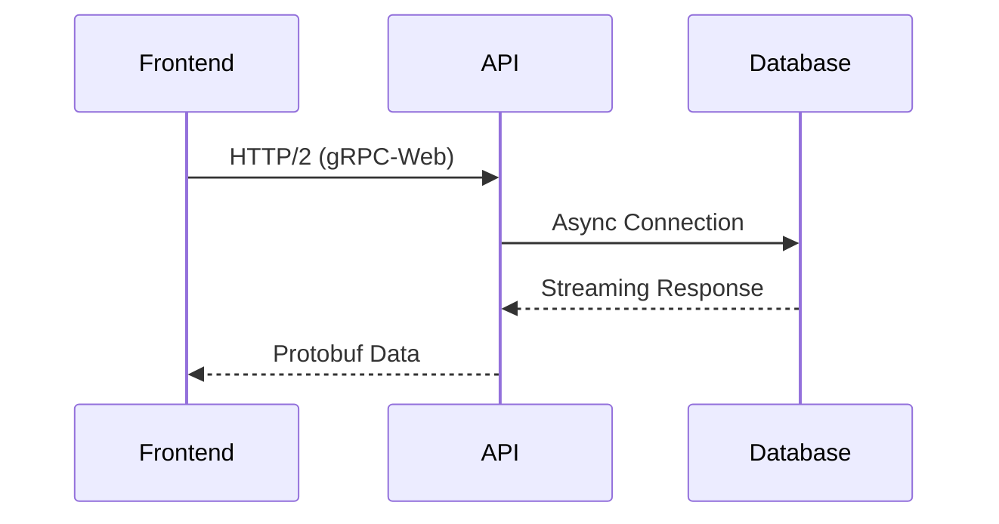

# 技术架构说明

## 一、前端技术栈
### Next.js 14 (App Router)
- **选型理由**：
  - 服务端渲染优化首屏加载性能
  - 文件路由系统简化开发流程
  - 支持API路由实现全栈能力

### Tailwind CSS 3.4
```bash
# 版本依赖
"dependencies": {
  "tailwindcss": "^3.4.0",
  "postcss": "^8.4.38",
  "autoprefixer": "^10.4.19"
}
```

### DaisyUI 4.6
- **集成方案**：
  1. 主题配置扩展Tailwind
  2. 组件库按需引入
  3. 自定义主题生成器

## 二、后端技术栈
### FastAPI 0.110
```python
# 核心依赖
fastapi = "==0.110.0"
sqlalchemy = {extras = ["asyncio"], version = "^2.0.30"}
pandas = "^2.2.2"
```

### SQLite + SQLAlchemy 2.0
- **优化方案**：
  - 连接池管理
  - 异步查询执行
  - 内存数据库缓存

## 三、跨栈集成


## 四、部署方案
1. 使用Docker容器化部署
2. 配置Kubernetes集群管理
3. 实现自动扩缩容
4. 配置CI/CD流水线